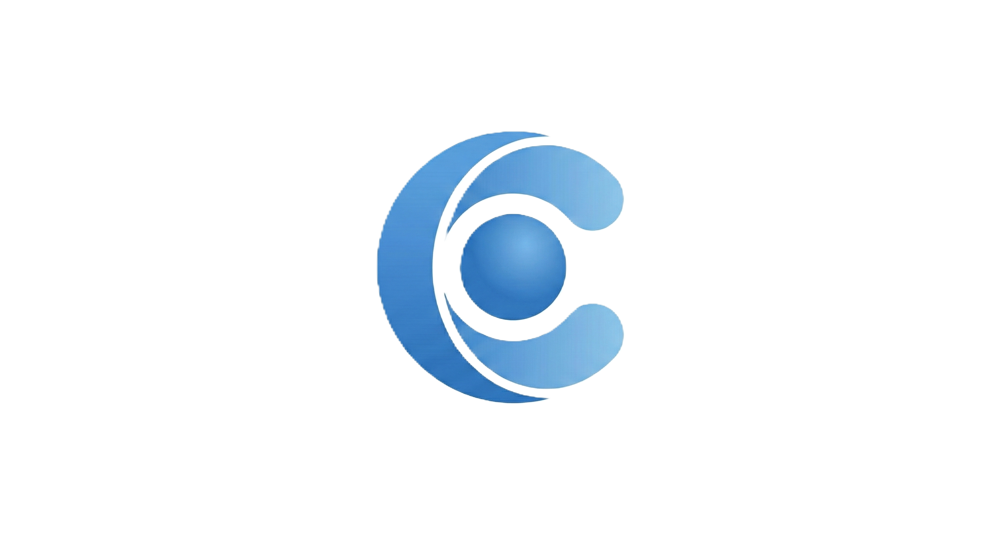

# ConstructLM

A powerful AI-powered document analysis and chat application with multi-model support, advanced document processing, and intelligent conversation management.



## 🌟 Features

### 🤖 Multi-Model AI Support
- **Google Gemini Models**: Flash, Pro, and latest versions with 1M+ token context windows
- **Groq Models**: Llama 3.3 70B, Llama 3.1 8B, Qwen 3 32B, and more ultra-fast models
- **OpenAI Models**: GPT-4o and GPT-4o Mini (paid)
- **AWS Bedrock**: Claude 3.5 Sonnet, Claude 3 Haiku, Llama 3, Mistral Large
- **Local Models**: Support for running models locally via Ollama

### 📄 Advanced Document Processing
- **Multi-format Support**: PDF, DOCX, TXT, CSV, Excel, Markdown, and more
- **Intelligent Parsing**: Extract text, tables, and structure from complex documents
- **Document Viewer**: Built-in viewer with page navigation, search, and highlighting
- **Citation System**: Inline citations with direct links to source documents
- **RAG (Retrieval-Augmented Generation)**: Semantic search across uploaded documents

### 💬 Smart Chat Features
- **Multi-Chat Management**: Create, switch, and manage multiple conversation threads
- **Context-Aware**: Automatically manages context windows and token limits
- **File Mentions**: Use `@filename` to reference specific documents in conversations
- **Web Sources**: Add URLs as context sources for research and analysis
- **Message Controls**: Retry, regenerate, save to notes, and view alternative outputs
- **Voice Input**: Speech-to-text transcription for hands-free interaction

### 🎨 Visual & Creative Tools
- **Mind Map Generator**: AI-powered mind maps from documents and conversations
- **Drawing Tools**: Annotate and sketch directly on the interface
- **Snapshot System**: Capture and save conversation states with visual previews
- **Graphics Library**: Manage and reuse generated visualizations

### 📝 Productivity Features
- **Notebook**: Save important AI responses as organized notes
- **Todo List**: Advanced task management with subtasks, priorities, and progress tracking
- **Reminders**: Set time-based reminders with snooze functionality
- **Activity Logging**: Track usage patterns and model performance
- **Export Options**: Export notes, conversations, and data

### 🌐 Web Integration
- **Tabbed Web Viewer**: Browse websites within the app with cookie persistence
- **GitHub Integration**: Browse and import code from any public GitHub repository
  - Repository browser with folder navigation
  - Multi-file selection and batch import
  - Branch switching and code search
  - Smart import of README and config files
  - AI-powered code analysis and documentation
- **CORS Proxy**: Automatic proxy rotation for accessing web content
- **Live Sessions**: Real-time collaborative features (Electron only)

### 🎯 Advanced Capabilities
- **Smart Context Management**: Automatic file selection based on relevance
- **Compression Service**: Optimize large documents for API limits
- **Rate Limit Handling**: Intelligent cooldown and retry mechanisms
- **Embedding Service**: Vector-based semantic search (optional)
- **User Profiles**: Personalized greetings based on usage patterns

## 🚀 Getting Started

### Prerequisites

- **Node.js** (v16 or higher)
- **npm** or **yarn**
- API keys for your preferred AI providers (at least one required)

### Installation

1. **Clone the repository**
   ```bash
   git clone https://github.com/yourusername/ConstructLM.git
   cd ConstructLM
   ```

2. **Install dependencies**
   ```bash
   npm install
   ```

3. **Set up environment variables**
   
   Create a `.env.local` file in the root directory:
   ```env
   # Required: At least one API key
   VITE_GEMINI_API_KEY=your_gemini_api_key_here
   
   # Optional: Additional providers
   GROQ_API_KEY=your_groq_api_key_here
   OPENAI_API_KEY=your_openai_api_key_here
   
   # Optional: AWS Bedrock
   AWS_ACCESS_KEY_ID=your_aws_access_key
   AWS_SECRET_ACCESS_KEY=your_aws_secret_key
   AWS_REGION=us-east-1
   ```

4. **Run the development server**
   ```bash
   npm run dev
   ```

5. **Open your browser**
   
   Navigate to `http://localhost:5173` (or the URL shown in your terminal)

## 🔑 Getting API Keys

### Google Gemini (Free Tier Available)
1. Visit [Google AI Studio](https://makersuite.google.com/app/apikey)
2. Sign in with your Google account
3. Click "Create API Key"
4. Copy the key to your `.env.local` file

### Groq (Free Tier Available)
1. Visit [Groq Console](https://console.groq.com/)
2. Sign up for a free account
3. Navigate to API Keys section
4. Generate a new API key

### OpenAI (Paid)
1. Visit [OpenAI Platform](https://platform.openai.com/)
2. Create an account and add billing information
3. Go to API Keys section
4. Create a new secret key

### AWS Bedrock (Paid)
1. Set up an AWS account
2. Enable Bedrock service in your region
3. Create IAM credentials with Bedrock access
4. Configure AWS credentials

## 📦 Building for Production

### Web Application
```bash
npm run build
npm run preview
```

### Desktop Application (Electron)

**Development:**
```bash
npm run electron:dev
```

**Build for Windows:**
```bash
npm run electron:build
```

The installer will be created in the `release/` directory.

## 🎮 Usage Guide

### Basic Chat
1. Select a model from the header dropdown
2. Type your message in the input field
3. Press Enter or click Send
4. View AI responses with inline citations

### Document Analysis
1. Click the file upload button or drag & drop files
2. Files appear in the left sidebar
3. Use `@filename` in chat to reference specific documents
4. Click citations in responses to view source locations

### Advanced Features

**Mind Maps:**
- Right-click a document → "Generate Mind Map"
- AI creates an interactive visualization of document structure

**Web Research:**
- Click the link icon in the input area
- Add URLs as context sources
- AI can reference web content in responses

**Voice Input:**
- Click the microphone icon
- Speak your message
- AI transcribes and processes your speech

**Notebook:**
- Click the bookmark icon on any AI response
- Access saved notes from the header
- Export notes as markdown or PDF

**Todo List:**
- Switch to Todos tab in header
- Create tasks with priorities, categories, and subtasks
- Track progress and completion

## 🛠️ Configuration

### Settings Modal
Access via the gear icon in the header:
- Configure API keys for all providers
- Adjust model preferences
- Manage storage and cache
- View activity logs
- Export/import data

### Custom Rules
Create custom behavior rules in `.amazonq/rules/` directory to control AI responses and feature behavior.

## 📁 Project Structure

```
ConstructLM-1/
├── App/                    # Core application logic
│   ├── components/         # Main app components
│   ├── handlers/           # Event handlers
│   ├── hooks/              # React hooks
│   └── types.ts            # TypeScript types
├── components/             # UI components
│   ├── CitationRenderer/   # Citation display system
│   ├── DocumentViewer/     # Document viewing components
│   └── ...                 # Other UI components
├── services/               # Business logic services
│   ├── geminiService.ts    # Google Gemini integration
│   ├── llmService.ts       # Multi-model LLM service
│   ├── fileParser.ts       # Document parsing
│   ├── ragService.ts       # RAG implementation
│   └── ...                 # Other services
├── electron/               # Electron desktop app
├── server/                 # Proxy server
└── styles/                 # CSS styles
```

## 🔧 Technologies Used

- **Frontend**: React 19, TypeScript, Vite
- **UI**: Tailwind CSS, Lucide Icons
- **3D Graphics**: Three.js, React Three Fiber
- **Document Processing**: PDF.js, XLSX, Mammoth
- **AI Integration**: Google Generative AI, OpenAI SDK, AWS SDK
- **Desktop**: Electron, Electron Builder
- **Storage**: IndexedDB (idb-keyval), LocalStorage
- **Markdown**: React Markdown, Mark.js

## 🤝 Contributing

Contributions are welcome! Please feel free to submit a Pull Request.

1. Fork the repository
2. Create your feature branch (`git checkout -b feature/AmazingFeature`)
3. Commit your changes (`git commit -m 'Add some AmazingFeature'`)
4. Push to the branch (`git push origin feature/AmazingFeature`)
5. Open a Pull Request

## 📝 License

This project is licensed under the MIT License - see the LICENSE file for details.

## 🐛 Known Issues

- Large PDF files (>50MB) may take time to process
- Some websites may not load in the web viewer due to CORS restrictions
- Local model support requires Ollama to be running

## 🔮 Roadmap

- [ ] Multi-user collaboration features
- [ ] Plugin system for custom integrations
- [ ] Mobile app (React Native)
- [ ] Advanced analytics dashboard
- [ ] Custom model fine-tuning interface
- [ ] Team workspace features

## 💡 Tips & Tricks

- Use `Ctrl/Cmd + K` to quickly switch models
- Drag files directly onto the chat area for instant upload
- Right-click on messages for quick actions
- Use the snapshot feature to save important conversation states
- Enable activity logging to track token usage and costs

## 📧 Support

For issues, questions, or suggestions:
- Open an issue on GitHub
- Check the Help Documentation (? icon in app)
- Review activity logs for debugging

## 🙏 Acknowledgments

- Google Gemini for powerful AI capabilities
- Groq for ultra-fast inference
- OpenAI for industry-leading models
- The open-source community for amazing tools and libraries

---

**Built with ❤️ for researchers, developers, and knowledge workers**
